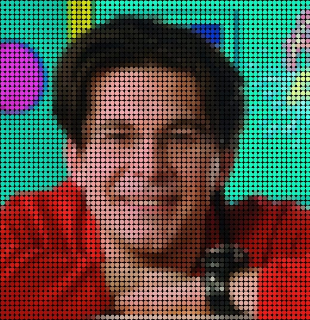

# PyXelize
A simple program that applies convolution over images and video stream producing different outputs

I wrote this code as a personal excercise, to learn how to convolve over 2d-array.
This code includes a set of different "filters" that applied to images produces fancy effects.

Here is a list of the included filters:

- **PIXELIZE_ASCII**: create an ascii art out of the input image; the simple_density parameter allows to choose between 2 given charsets, with a different density result.
- **PIXELIZE_COLORED/GRAYSCALE**: create an image composed of squares with given size, colored basing on the mean value of the input image in that given square.
- **PIXELIZE_DOT**: same as above, but with dots instead of squares
- **PIXELIZE_RANDOMIZED**: Applies the PIXELIZE_COLORED over the input image, then applies a random delta over all pixels, producing a noisy output

The project also include a face tracking code, that allows to apply filters only over the faces.

Here is some output samples:

|Sample|PIXELIZE_ASCII|PIXELIZE_ASCII_SIMPLE|
:-------------------------:|:-------------------------:|:-------------------------:
||||
|PIXELIZE_COLORED|PIXELIZE_GRAYSCALE|PIXELIZE_RANDOMIZED|
||||
|PIXELIZE_DOT|PIXELIZE_FACE|SCRUMBLE_FACE|
||||

I used this code to produce my profile pic, hope you like it and find it useful!
